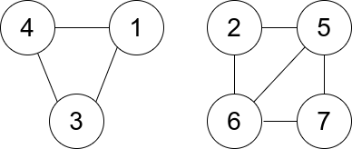

# 1761. Minimum Degree of a Connected Trio in a Graph

You are given an undirected graph. You are given an integer `n` which is the number of nodes in the graph and an array `edges`, where each edges[i] = [ui, vi] indicates that there is an undirected edge between ui and vi.

A **connected trio** is a set of **three** nodes where there is an edge between **every** pair of them.

The **degree of a connected trio** is the number of edges where one endpoint is in the trio, and the other is not.

Return the **minimum** degree of a connected trio in the graph, or `-1` if the graph has no connected trios.

Example 1:

**Input:** n = 6, edges = [[1,2],[1,3],[3,2],[4,1],[5,2],[3,6]]

**Output:** 3

**Explanation:** There is exactly one trio, which is [1,2,3]. The edges that form its degree are bolded in the figure above.

Example 2:

**Input:** n = 7, edges = [[1,3],[4,1],[4,3],[2,5],[5,6],[6,7],[7,5],[2,6]]

**Output:** 0

**Explanation:** There are exactly three trios:
1) [1,4,3] with degree 0.
2) [2,5,6] with degree 2.
3) [5,6,7] with degree 2.
 

**Constraints:**

`2 <= n <= 400`

`edges[i].length == 2`

`1 <= edges.length <= n * (n-1) / 2`

1 <= ui, vi <= n
ui != vi

There are no repeated edges.