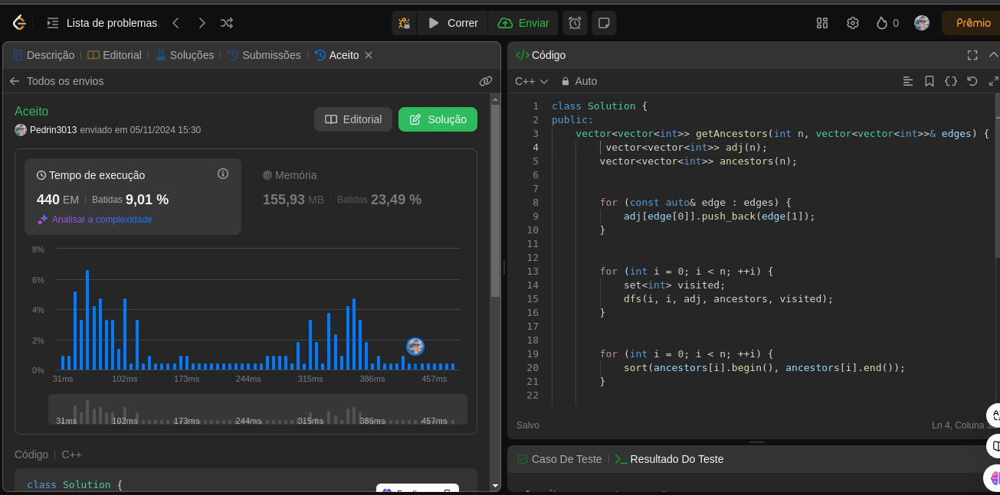
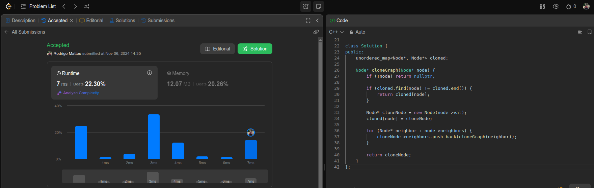
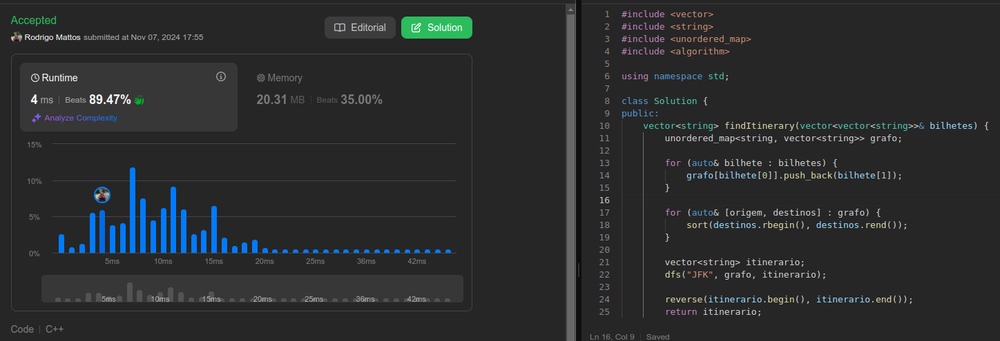
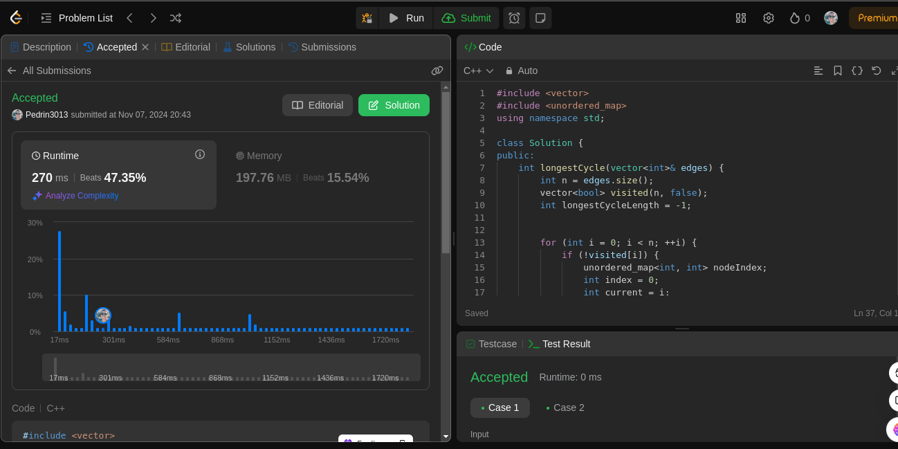
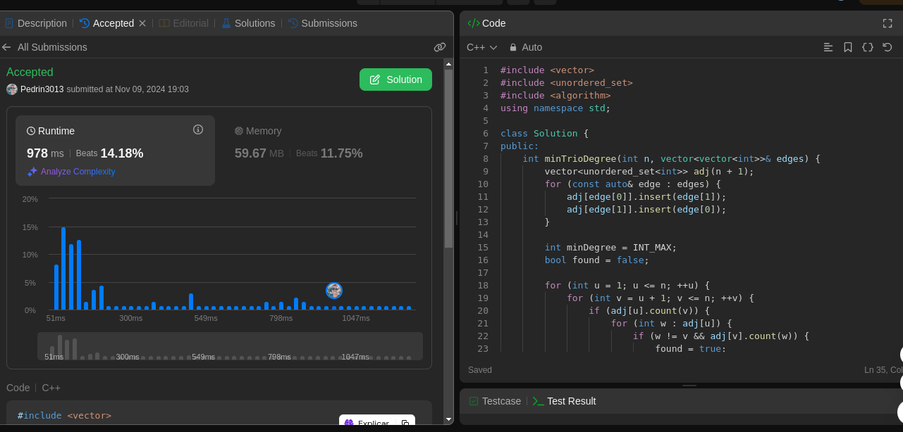

# Grafos1_QuestoesLeetCode

**Número da Lista**: 53 
**Conteúdo da Disciplina**: GRAFOS 1 

## Alunos
|Matrícula | Aluno |
| -- | -- |
| 22/1008688  |  Pedro Paulo Santos Almeida |
| 18/0108875  |  Rodrigo Mattos de Figueiredo Ayres Bezerra |

## Sobre 
O nosso é um projeto de questões do juíz online leetCode, que é um ambiente onde fornece questões de diversos tipos como do mais fácil ao mais difícil para uma boa compreensão sobre os gráfos. Todas as questões estão disṕníveis para qualquer pessoa que deseja ver. 

## Screenshots
Adicione 3 ou mais screenshots do projeto em funcionamento.

**Questão 2192**

**Questão 133**

**Questão 332**

**Questão 2360**

**Questão 1761**

## Instalação 
**Linguagem**: C++ 

## Uso 
Para usar, deve-se entrar no site do [leetCode](https://leetcode.com/), pesquisar a questão na aba de perguntas e copiar a solução indica e testar no local apropriado no site.
## Outros 
| N° Questão | Descrição questão | Dificuldade |
| --- | ------- | ---------- |
| 2192 | All Ancestors of a Node in a Directed Acyclic Graph  |   Média |
| 133  | Clone Graph   |   Média       |
| 332  | Reconstruct Itinerary   |   Difícil      |
| 2360    | Longest Cycle in a Graph   |   Difícil       |
| 1761    | Minimum Degree of a Connected Trio in a Graph  |   Difícil       |
| xxxx    | xxxxx   |   xxxxx       |
